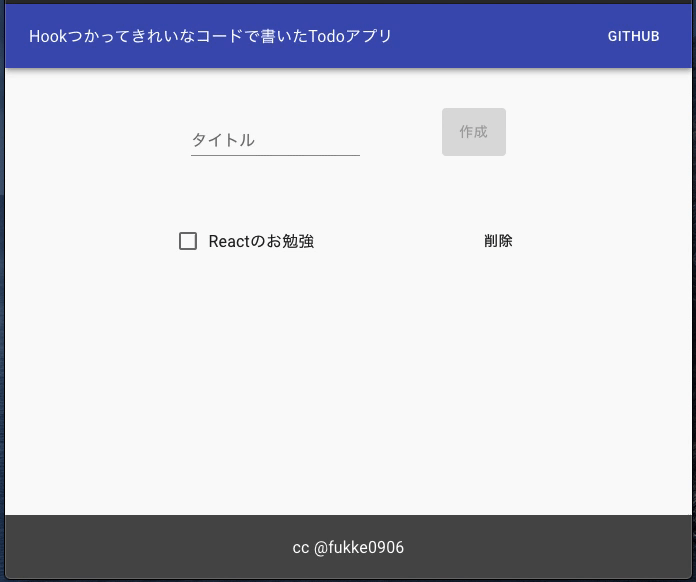

## はじめに
React16.8で追加されたフックを使ってTodoアプリを作ります.  
フックを使うとクラスコンポーネントをファンクショナルコンポーネントに書き換えることができ, 綺麗なコードにすることができます.  

> Hookについて[公式]  
> https://ja.reactjs.org/docs/hooks-intro.html  

## 導入
以下の環境です.  
- node v12.8.0
- yarn v1.21.0
- crate-react-app v3.3.0  

> 完成品URL  
> https://fukekazki.github.io/React-Todo-App/  
> リポジトリ  
> https://github.com/FukeKazki/React-Todo-App  

## コード解説  
App.jsの処理部分を解説します.  
```javascript
import React, {useState} from 'react'
import 'typeface-roboto'
import {
    Button,
    TextField,
    Box,
    Container,
    CssBaseline,
    List,
    ListItem,
    ListItemText,
    Checkbox,
} from '@material-ui/core'
import Header from './Header'
import Footer from './Footer'

const INITIAL_TASK = {
    title: 'Reactのお勉強',
    doing: false,
}

const App = () => {
    const [tasks, setTasks] = useState([INITIAL_TASK])
    const [task_title, setTask_title] = useState('')

    const handleTextFieldChanges = e => {
        setTask_title(e.target.value)
    }

    const resetTextField = () => {
        setTask_title('')
    }

    const isTaskInclude = () => {
        return tasks.some(task => task.title === task_title)
    }

    const addTask = () => {
        setTasks([...tasks, {
            title: task_title,
            doing: false,
        }])
        resetTextField()
    }

    const deleteTask = (task) => {
        setTasks(tasks.filter(x => x !== task))
    }

    const handleCheckboxChanges = task => {
        setTasks(tasks.filter(x => {
            if (x === task) x.doing = !x.doing
            return x
        }))
    }

    return (
        <React.Fragment>
            <Header/>
            <Container component='main' maxWidth='xs'>
                <CssBaseline/>
                <Box
                    mt={5}
                    display='flex'
                    justifyContent='space-around'
                >
                    <TextField
                        label='タイトル'
                        value={task_title}
                        onChange={handleTextFieldChanges}
                    />
                    <Button
                        disabled={task_title === '' || isTaskInclude()}
                        variant='contained'
                        color='primary'
                        onClick={addTask}
                        href=''
                    >
                        作成
                    </Button>
                </Box>
                <List
                    style={{marginTop: '48px'}}
                    component='ul'>
                    {tasks.map(task => (
                        <ListItem key={task.title} component='li'>
                            <Checkbox
                                checked={task.doing}
                                value='primary'
                                onChange={() => handleCheckboxChanges(task)}
                            />
                            <ListItemText>{task.title}</ListItemText>
                            <Button
                                href=''
                                onClick={() => deleteTask(task)}
                            >
                                削除
                            </Button>
                        </ListItem>
                    ))}
                </List>
            </Container>
            <Footer/>
        </React.Fragment>
    )
}

export default App
```  

### タスクの持つ状態  
17-28行で定義しています.  
titleとチェックされているかどうかを判別するためにdoingをもたせました.  
```javascript
const INITIAL_TASK = {
    title: 'Reactのお勉強',
    doing: false,
}
```

### stateについて  
23-24行で定義しています.  
useStateの引数には初期値を渡しています.  
左辺は分割代入を使って0番目がstate, 1番目がいままでのsetState関数になります.  
```javascript
const [tasks, setTasks] = useState([INITIAL_TASK])
const [task_title, setTask_title] = useState('')
```

### タスクの追加
38-44行です.  
setTasks関数の引数にスプレッド演算子を用いて展開と追加をしています.  
```javascript
const addTask = () => {
    setTasks([...tasks, {
        title: task_title,
        doing: false,
    }])
    resetTextField()
}
```

### タスクの削除
46-48行です.  
filterを用いて削除を実装しています.  
```javascript
const deleteTask = (task) => {
    setTasks(tasks.filter(x => x !== task))
}
```

### タスクの検索
34-36行です.  
同じタスク名のものを追加できないようにそのタスクがすでに存在しているかどうかを検索します.  
someを用いると条件式に一致するものがあるかどうかを真偽値で返してくれます.  
```javascript
const isTaskInclude = () => {
    return tasks.some(task => task.title === task_title)
}
```

### タスクの表示
82-101行です.  
Material UIのListを用いています.  
mapを使ってtasks配列内の値を表示しています.  
```javascript
<List
    style={{marginTop: '48px'}}
    component='ul'>
    {tasks.map(task => (
         <ListItem key={task.title} component='li'>
            <Checkbox
                checked={task.doing}
                value='primary'
                onChange={() => handleCheckboxChanges(task)}
            />
                <ListItemText>{task.title}</ListItemText>
                <Button
                    href=''
                    onClick={() => deleteTask(task)}
                >
                    削除
                </Button>
            </ListItem>
    ))}
</List>
```

### フォーム
67-80行です.  
特に解説はないです()  
```javascript
<TextField
    label='タイトル'
    value={task_title}
    onChange={handleTextFieldChanges}
/>
<Button
    disabled={task_title === '' || isTaskInclude()}
    variant='contained'
    color='primary'
    onClick={addTask}
    href=''
>
    作成
</Button>
```

## おわり
Hookを使うとコードがきれいになってうれしい！！  
みんなHookつかってね♡  