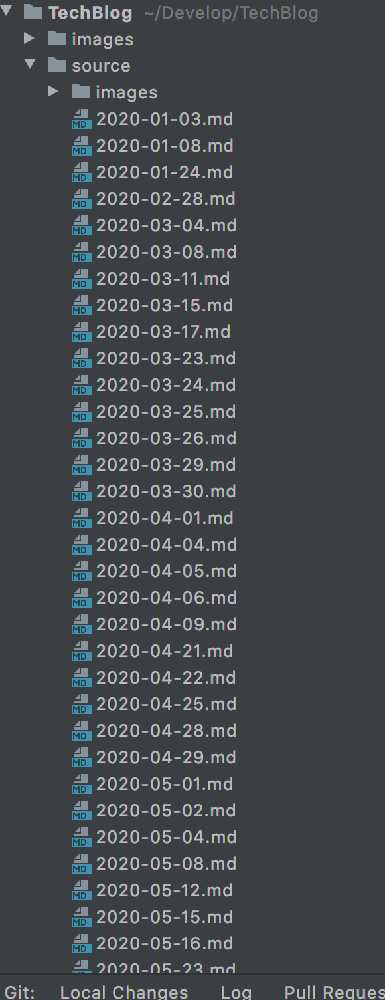
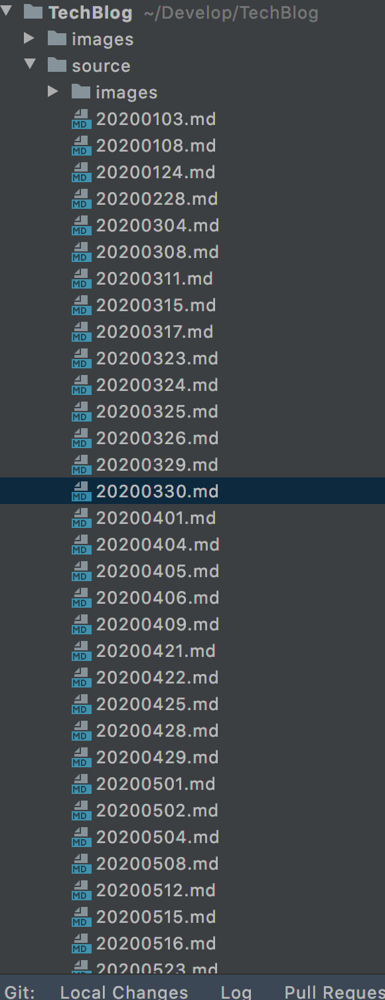

ブログのファイル  
いらないハイフン  

  
雑なライム。。  

## ファイル名の変更
これを

こうじゃ！


### コード
```typescript
import * as fs from 'fs'

const path = process.cwd()

const fileNames = fs.readdirSync(path)

const markdownFiles = fileNames.filter(name => /\.md$/.test(name))

markdownFiles.map(prevName => {
	const nextName = prevName.replace(/-/g, '')

	fs.rename(prevName, nextName, err => {
		if (err) {
			console.log(`Rename Failed: ${err}`)
		} else {
			console.log(`${prevName} --> ${nextName}`)
		}
	})
})
```

`process.cwd`でファイルが実行されているパスが取得できます。 初知り  
ファイル・ディレクトリの操作はfsモジュールがやってくれます。  
ファイル名を全て取得 -> マークダウンファイルだけにする -> 新しいファイル名を決める -> ファイル名の変更　　
って感じです。  
正規表現って皆覚えてるんですか？？  
ぼくは全く覚えてないのでいつもぐぐりまくってますね。  
このまえツイッターで見つけたこのサイトが便利だったので共有します。
正規表現が視覚化できるのですこし理解が進みます。  

> https://jex.im/regulex/#!flags=&re=%5E(a%7Cb)*%3F%24

## ファイルの生成
ついでにいつも手作業でやってたブログのファイル作成のプログラムも作成します。  
仕様はその日の日付のファイルを作成してテンプレートを埋め込むです。  

```typescript
import * as fs from 'fs'

const year = (new Date().getFullYear()).toString()
const month = (new Date().getMonth() + 1).toString().padStart(2, '0')
const date = (new Date().getDate()).toString().padStart(2, '0')

const fileName = `${year}${month}${date}.md`

const isExist = fs.existsSync(fileName)

const template = `---
title: ''
date: ${year}-${month}-${date}
tags: []
---
`

if (!isExist) {
	try {
		fs.writeFileSync(fileName, template)
		console.log(`Success: ${fileName} was created.`)
	} catch (e) {
		console.log(`Failed: Can not create ${fileName}`)
	}
} else {
	console.log(`Failed: ${fileName} is already exist.`)
}
```

日付の操作はそろそろ慣れてきましたが、やっぱり標準のDateオブジェクトは使いづらい。。  
padStartメソッド、体感よく使ってます。好きです。  
fs.writeFileSyncメソッドの仕様が指定されたファイル名が存在すれば上書きする、でそれは困る(困る)ので存在したときは生成しないようにしています。  
  
## 実用的なプログラミングってあんましないですよね  
いっつもしょうもないプログラム作ってる気がする(アイドルのサイトスクレイピングしたりね。)  